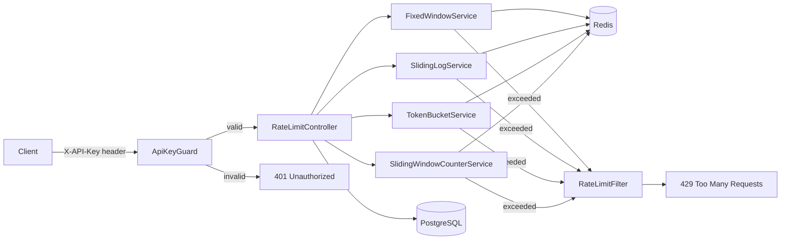

# Rate Limiter as a Service

A distributed rate limiting API built with NestJS and Redis, implementing four different 
rate limiting strategies. Designed for applications with high network traffic that need 
fine-grained control over request rates.

## What problem does it solve?

Without rate limiting, a single client can overwhelm your API with requests, causing 
degraded performance for all users. This project provides a ready-to-use rate limiting 
service that can be plugged into any application via a simple HTTP API.

## Architecture

## Architecture


```

## Quick Start

```bash
git clone https://github.com/antoni306/rate-limiter.git
cd rate-limiter
cp .env.example .env
docker-compose up --build
```

### .env.example
```
PORT=3000
NODE_ENV=development
DB_HOST=localhost
DB_PORT=5432
DB_USER=postgres
DB_PASSWORD=postgres
DB_NAME=ratelimiter
REDIS_HOST=localhost
REDIS_PORT=6379
```
API docs available at `http://localhost:3000/docs`

## Strategies

### Fixed Window
For each time frame you have a fixed number of available requests. After you exceed the limit, 
you have to wait for the next window. Best for things like login endpoints — without it someone 
could keep trying to brute force an account.
**Best for:** login, password reset, simple API endpoints
**Cons:** allows bursts at window boundaries — a client can exhaust the limit at the end of one 
window and immediately do the same at the start of the next.

### Sliding Log
Stores a timestamp for every request. Checks how many requests happened in the last N seconds — 
no fixed windows, so no boundary bursts.
**Best for:** strict per-user rate limiting where accuracy matters
**Cons:** with high traffic the log can get large — memory usage grows with request count.

### Sliding Window Counter
Similar to sliding log but stores only two counters — current and previous window. Calculates 
a weighted estimate of requests in the last N seconds. Much more memory efficient than sliding log.
**Best for:** high traffic APIs where memory matters but you still want better accuracy than fixed window
**Cons:** it's an approximation — assumes requests in the previous window were evenly distributed, 
which may not always be true.

### Token Bucket
Tokens are added to a bucket at a fixed rate up to a maximum capacity. Each request consumes one token. 
If the bucket is empty, the request is rejected.
**Best for:** APIs that need to allow short bursts — tokens accumulate when traffic is low, 
so a client can spend them all at once when needed.
**Cons:** harder to reason about than fixed window — clients need to track token count to predict behavior.


## Benchmarks

Tested with [autocannon](https://github.com/mcollina/autocannon): 10 connections, 10 seconds, limit=10000, windowSeconds=60.

| Strategy | p50 | p95 | p99 | Throughput |
|---|---|---|---|---|
| fixed-window | 0ms | 2ms | 2ms | 11049 req/s |
| sliding-log | 8ms | 16ms | 21ms | 1040 req/s |
| token-bucket | 8ms | 15ms | 19ms | 1159 req/s |
| sliding-window-counter | 9ms | 17ms | 19ms | 993 req/s |

Fixed window is ~10x faster than other strategies because it only performs two Redis operations 
(`INCR` + `EXPIRE`). Sliding log is the most expensive — it requires four operations per request 
(`ZADD`, `ZREMRANGEBYSCORE`, `ZCARD`, `ZRANGE`). Sliding window counter and token bucket fall 
in between, offering a good balance between accuracy and performance.


## Design Decisions

### Why Redis?
Redis is an in-memory database which makes it extremely fast for read/write operations. 
Since rate limiting happens on every single request, latency here directly affects 
the end user — a slow rate limiter defeats its own purpose. Redis also provides 
atomic operations like INCR which are essential for correctness under concurrent load.


### Why Sliding Window Counter is a good compromise?
It stores only two integer counters per client instead of a full request log. 
Memory usage stays constant regardless of traffic volume. Accuracy is better than 
fixed window because it accounts for the previous window's weight, while being 
significantly cheaper than sliding log in both memory and Redis operations.